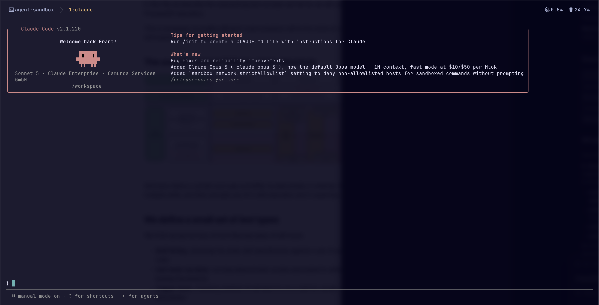
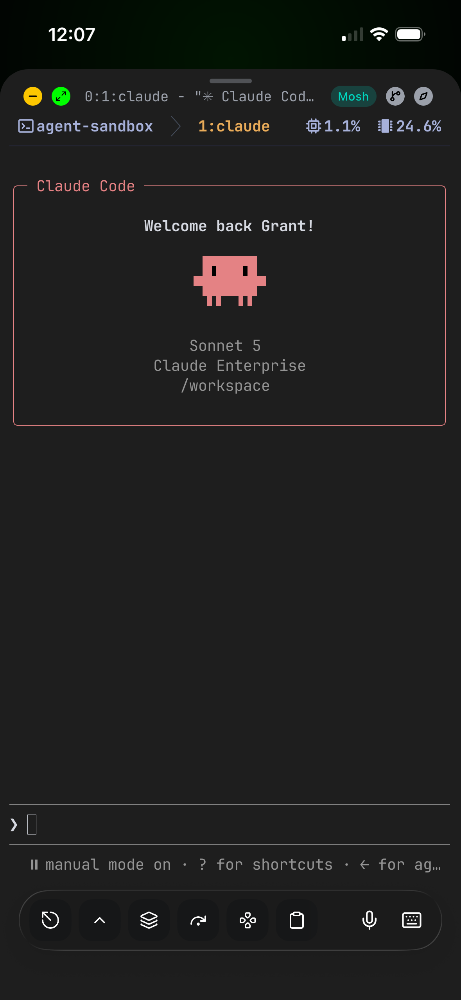
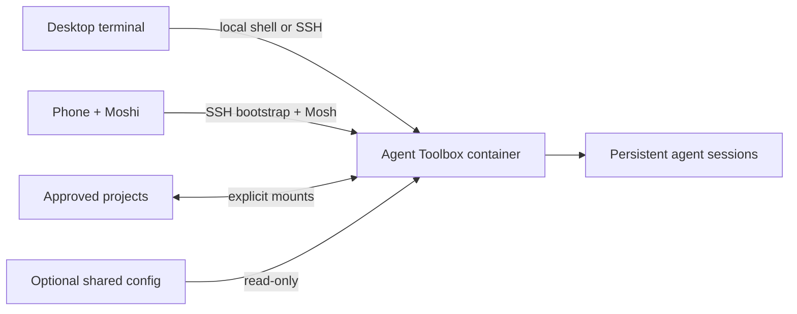

# Agent Toolbox

A container-scoped AI development host for running Codex CLI, Claude Code, and
other terminal agents with less access to the host machine. Agent Toolbox
combines an explicit-mount security boundary with persistent sessions and
SSH/Mosh access from a desktop or phone.

It is the sandbox half of the
[terminal-first AI development environment](https://github.com/ukchucktown/dotfiles),
but it also works independently with its own portable Zsh, Starship, tmux,
Neovim, Eza, FZF, and zoxide setup.

## One session, two clients

<table>
  <tr>
    <td width="68%">
      
    </td>
    <td width="32%">
      
    </td>
  </tr>
  <tr>
    <td><strong>Laptop:</strong> Ghostty attached to the persistent <code>agent-sandbox</code> tmux session.</td>
    <td><strong>Phone:</strong> Moshi and Mosh attached to the same session while away from the home network.</td>
  </tr>
</table>

Both clients are viewing the same `1:claude` tmux window. Work continues inside
the container when either client sleeps, changes networks, or disconnects.

## Why Agent Toolbox

- **Narrow host exposure:** projects and configuration appear only through a
  reviewed list of read-write or read-only mounts. The Docker socket, host home
  directory, SSH configuration, and system credential stores are not mounted.
- **A complete toolchain:** agents receive pinned JavaScript, Python, Java,
  Rust, GitHub, Camunda, editor, shell, and native build tools.
- **Durable work:** tmux and Herdr keep shells and agents alive across client
  disconnects while named volumes retain agent login and pairing state.
- **Phone orchestration:** SSH provides key authentication, Mosh handles roaming
  between networks, and Moshi supplies the mobile agent experience.



## Quick start

The default configuration listens only on the local machine. Choose a project
directory that agents are allowed to read and modify:

```bash
git clone https://github.com/ukchucktown/agent-toolbox.git
cd agent-toolbox
cp .env.example .env
./sandbox mount add /absolute/path/to/projects /workspace
./sandbox build
./sandbox up
./sandbox status
```

Then open a local shell with `./sandbox shell`. Configure key-only SSH and read
[SECURITY.md](SECURITY.md) before making the service reachable from another
device or network.

The Docker runtime retains the `agent-sandbox` name so existing installations
can upgrade without creating new containers or volumes.

## Container toolchain

Agent Toolbox is a ready-to-use development environment, not just an SSH
server. The image includes:

| Area | Included tools |
| --- | --- |
| Agent workflow | Codex CLI, Claude Code, Herdr, Mosh, and Moshi agent hooks |
| JavaScript | Node.js 22, npm, Corepack, and pnpm support |
| Python | Python 3.14 and uv |
| Java | Eclipse Temurin Java 25 and Maven 3.9 |
| Camunda 8 | `c8`, `c8ctl`, and the BPMN, element-template, and FEEL commands |
| GitHub | Git, Git LFS, and GitHub CLI (`gh`) |
| Editors | Neovim 0.12 with built-in `vim.pack`, Tree-sitter CLI, Vim, and Nano |
| Shell | Bash, Zsh, Starship, tmux, `fzf`, `eza`, `bat`, `fd`, `zoxide`, `rg`, and `jq` |
| Native builds | GCC, G++, Make, and other standard build tools |

Runtime version lines and independently downloaded tool releases are pinned in
the selected environment file so upgrades remain deliberate. Run
`./sandbox versions` to inspect the installed versions.

### Match your local shell

Zsh is the default shell for local container terminals, SSH connections, and
tmux. Starship is the sole prompt engine. The image installs `eza`, `zoxide`,
host-style listing aliases and FZF behavior, plus fzf-tab, autosuggestions,
history substring search, and syntax highlighting. The plugins are pinned
standalone checkouts under `/opt/zsh-plugins`; no shell framework or theme
manager is required. A mounted `/opt/agent-shell/zshrc` extends this portable
baseline instead of replacing it.

To keep personal shell settings outside this public repository, create a
dedicated directory containing a `zshrc` file and, optionally, `tmux.conf` and
other files sourced by that configuration. Mount only that directory:

```bash
./sandbox mount add /absolute/path/to/agent-shell /opt/agent-shell --read-only
./sandbox config
./sandbox up
```

When present, `/opt/agent-shell/zshrc` extends the built-in interactive Zsh
setup and `/opt/agent-shell/tmux.conf` extends the built-in tmux configuration.
Other files in that directory can be sourced by `zshrc`, which is useful for a
single shared prompt-spacing module. A custom Starship configuration can be
mounted read-only at `/opt/agent-starship.toml`. These files execute inside
every interactive session, so keep the directory private, exclude secrets, and
mount it read-only. Fonts, window chrome, and the terminal color theme remain
controlled by the host terminal emulator, such as Ghostty on macOS, and by the
mobile terminal on a phone.

### Share global agent skills read-only

If Codex and Claude share a canonical host collection at `~/.agents/skills`,
mount that directory at all three global discovery paths:

```bash
for target in \
  /home/agent/.agents/skills \
  /home/agent/.codex/skills \
  /home/agent/.claude/skills
do
  ./sandbox mount add "$HOME/.agents/skills" "$target" --read-only
done
```

These are the only permitted bind targets below `/home/agent`, and the mount
validator requires all three to be read-only. Codex and Claude can discover the
same global skills as the host, but skill installers and agent sessions cannot
add, update, or remove them. Authentication, settings, plugins, history, and
other client state remain independent in the `agent-home` volume.

## Camunda 8 development support

The container has the toolchain needed for Camunda 8 development:

- `c8` and `c8ctl` are equivalent entry points to the pinned Camunda CLI.
- Java 25 and Maven support Java clients, connectors, and job workers.
- Node.js, Python, and uv support application code and development tooling.
- Mounted project checkouts can be used directly from an agent session.
- An opt-in `host-local` profile lets c8ctl and application clients reach a
  Camunda 8 cluster running on the Docker host.

The host retains cluster lifecycle control. Agent Toolbox does not include
`c8run`, mount the Docker socket, or allow the container to manage Docker.
See [Connect to a host Camunda 8 cluster](#connect-to-a-host-camunda-8-cluster)
for the setup and security boundary.

## Security boundary

The container can read, modify, and delete everything in each read-write bind
mount. Mount only files and directories that may be accessed by the agents, and
prefer read-only mounts when modification is unnecessary.

The container does not mount the rest of the host home directory, host SSH
configuration, system credential stores, or the Docker socket, and it is not
privileged. However:

- The `agent` user has passwordless `sudo` inside the container.
- Outbound network access, including access to services on the local network,
  is not restricted.
- SSH local forwarding is enabled for Moshi integrations.
- Agent credentials and histories persist in the `agent-home` Docker volume.
- SSH host keys persist separately in the `ssh-host-keys` Docker volume.

This setup limits host filesystem exposure; it is not a boundary for running
untrusted prompts, dependencies, or code. See [SECURITY.md](SECURITY.md) before
making the SSH endpoint reachable outside the host.

## Requirements

- Docker Desktop or Docker Engine with Compose
- Bash
- One or more host files or directories to mount
- Moshi on a mobile device, if remote terminal access is desired

## Configure

The launcher reads environment configuration in this order:

1. The file named by `AGENT_TOOLBOX_ENV_FILE`
2. `~/.config/agent-toolbox/agent-sandbox.env`
3. The ignored `.env` file in this repository

For a simple local setup:

```bash
cp .env.example .env
```

For a Stow-managed setup, store the file in the dotfiles tree at:

```text
.config/agent-toolbox/agent-sandbox.env
```

The example binds SSH and Mosh to `127.0.0.1` for a safe local-only default. To
connect from another device on the LAN, deliberately change
`SSH_BIND_ADDRESS` to `0.0.0.0` after configuring key authentication. The
`MOSH_UDP_PORT_RANGE` setting controls the UDP ports published for Mosh; use
the same range in Moshi's connection settings.

### Manage mounts

Mount configuration is discovered independently:

1. The file named by `AGENT_TOOLBOX_MOUNTS_FILE`
2. `~/.config/agent-toolbox/compose.mounts.yaml`
3. The ignored `compose.mounts.yaml` file in this repository

The mount file is authoritative; the base Compose file contains no host bind
mounts. Its JSON syntax is also valid YAML and can be loaded directly by Docker
Compose. Initialize the primary workspace with:

```bash
./sandbox mount add /absolute/host/projects /workspace
```

Then use the launcher instead of editing the file:

```bash
# Show the active mount file and its entries.
./sandbox mount list

# Add another read-write directory.
./sandbox mount add /absolute/host/path /mounts/project

# Add a read-only directory.
./sandbox mount add /absolute/host/docs /mounts/docs --read-only

# Add a read-only configuration file.
./sandbox mount add /absolute/host/prompt.zsh /opt/prompt.zsh --read-only

# Remove a mount by its container target.
./sandbox mount remove /mounts/docs
```

Host sources must already exist and must be regular files or directories.
Container targets must be absolute and cannot overlap the persistent
`/home/agent` or `/etc/ssh/host_keys` mounts. The only exceptions are the exact
global skill targets documented above, and those are accepted only as
read-only mounts. The script also sets `create_host_path: false`, preventing a
mistyped host path from being silently created as an empty directory. At least
one mount must remain configured.

Mount commands change configuration only. Review and apply the result
explicitly:

```bash
./sandbox config
./sandbox up
```

When `~/.config` is managed by Stow, the helper updates the file inside the
dotfiles repository. Commit that dotfiles change to preserve the mount
list for future machines.

Applying a changed mount configuration recreates the container and stops its
current processes. The named credential, history, Moshi, and SSH-host-key
volumes are retained. Exit active agents and Herdr work before applying.

To initialize a mount file without the helper, copy
`compose.mounts.example.yaml` to one of the supported locations.

## Build and start

```bash
./sandbox build
./sandbox up
./sandbox status
```

The connection uses SSH for authentication and Mosh for the live terminal:

```text
Host: <host-lan-ip>
Port: <configured SSH_PORT, default 49222>
User: agent
Transport: Mosh
Mosh UDP range: <configured MOSH_UDP_PORT_RANGE, default 60000-60010>
```

The container accepts public-key authentication only. No login password is set.

## Authorize Moshi

Because Docker publishes a nonstandard SSH port, use Moshi's manual connection
flow instead of Easy Pair:

1. In Moshi, create or generate a dedicated Ed25519 key.
2. Copy the public key, not the private key.
3. Authorize it on the host. On macOS, the clipboard can be piped directly:

   ```bash
   pbpaste | ./sandbox authorize-key
   ./sandbox keys
   ./sandbox host-key
   ```

   On another platform, pass or pipe the public key to
   `./sandbox authorize-key`.

4. Add a Moshi connection using the host's LAN address and configured SSH
   port. Select **Mosh** and set its custom UDP range to the configured
   `MOSH_UDP_PORT_RANGE` value.
5. Compare Moshi's first-connect SSH fingerprint with `./sandbox host-key`.

SSH remains available as a fallback if the current network blocks UDP. Mosh
survives phone sleep, app suspension, and network changes; Herdr separately
keeps the shell and agent process alive if the Mosh session itself ends.

## Authenticate the agents

Authentication state remains inside the persistent `agent-home` volume.

For Codex:

```bash
./sandbox codex-login
```

Open the displayed URL on a trusted device and enter the one-time code.

For Claude Code:

```bash
./sandbox claude-login
```

Follow the browser login flow. If a browser cannot open in the container, open
the displayed URL on a trusted device and paste the returned code into the
terminal.

Check all installed tools:

```bash
./sandbox versions
```

Authenticate GitHub CLI separately:

```bash
./sandbox gh-login
```

This uses the browser flow and configures Git to use GitHub CLI credentials
over HTTPS. The login persists in the `agent-home` volume. It does not copy the
host's SSH keys or GitHub configuration into the container.

## Connect to a host Camunda 8 cluster

The sandbox can opt in to a Camunda 8 cluster that is already running on the
Docker host. This is useful when an agent needs to deploy or inspect Camunda
resources or run a Java worker while keeping the cluster outside the sandbox.
The host remains responsible for `c8run`, cluster startup, shutdown, logs, and
upgrades. The sandbox receives no Docker socket.

Start the local cluster on the host first, then enable the connection:

```bash
./sandbox camunda enable-host
./sandbox camunda status
```

The helper verifies the topology before creating a c8ctl profile named
`host-local`. It points to
`http://host.docker.internal:8080/v2` by default. For a different local base
URL, pass the origin without `/v2`:

```bash
./sandbox camunda enable-host http://host.docker.internal:8090
```

Inside the sandbox, make the profile explicit on every c8ctl command:

```bash
c8ctl get topology --profile=host-local
c8ctl deploy process.bpmn --profile=host-local
```

The shorter `c8` command is also available:

```bash
c8 get topology --profile=host-local
```

The helper never changes c8ctl's globally selected profile. Disable this
integration by removing only the managed profile:

```bash
./sandbox camunda disable-host
```

For a Java worker that should connect directly to the same host cluster, set
these values only for that worker process:

```bash
export CAMUNDA_CLIENT_MODE=self-managed
export CAMUNDA_CLIENT_RESTADDRESS=http://host.docker.internal:8080
export CAMUNDA_CLIENT_GRPCADDRESS=http://host.docker.internal:26500
```

This is a logical opt-in, not a network firewall. The container has normal
outbound networking and can reach host services that Docker Desktop exposes.
The helper makes the intended Camunda connection explicit and reversible.
Workflows that require Docker, such as starting `c8run` or running
Docker-backed integration tests, should remain on the host or CI. Camunda
resource authoring, CLI operations, Java builds, and agent workflows can run
inside the sandbox against mounted projects.

## Pair Moshi agent hooks

In Moshi, open **Settings → Agent Hooks** and copy the pairing token. Then run:

```bash
./sandbox moshi-pair
```

The command prompts without echoing the token, stores the credential inside the
persistent home volume, installs hooks for Codex and Claude Code, and restarts
the container daemon.

Diagnostics:

```bash
./sandbox status
./sandbox logs
```

## Run agents with Herdr

Connect using Moshi, then:

```bash
cd /workspace/<project>
herdr
```

Start `codex` or `claude` in Herdr tabs. The primary project mount is normally
available below `/workspace`; additional directories appear at their configured
container targets.

For a conventional shared terminal instead, use tmux:

```bash
tmux new -As agent
```

Run the same command from Ghostty or the phone to attach to that session.

## Reach it away from home

A private VPN or a hardened bastion is preferred. If direct router forwarding
is the only available option, reserve the host's LAN address and forward the
configured SSH port plus the configured Mosh UDP range:

```text
External/global port: <SSH_PORT>
Destination device:   <host-lan-ip>
Base/internal port:   <SSH_PORT>
Protocol:             TCP

External port range:  <MOSH_UDP_PORT_RANGE>
Destination device:   <host-lan-ip>
Internal port range:  <MOSH_UDP_PORT_RANGE>
Protocol:             UDP
```

Use the public IPv4 address or a DDNS hostname in Moshi. Keep the configured
SSH port, user `agent`, key authentication, Mosh transport, and custom UDP
range, then test over a cellular connection. Forwarding is unnecessary when
the phone reaches the host through a VPN such as Tailscale.

A high port reduces scanner noise but is not a security boundary. Use a
dedicated Moshi key, verify the SSH host fingerprint, protect the phone with a
strong device passcode, and remove the forwarding rule when remote access is
not needed.

## Daily commands

```text
./sandbox up             Start
./sandbox down           Stop without deleting credentials
./sandbox shell          Open a local container shell
./sandbox restart        Restart
./sandbox status         Show container and tool status
./sandbox config         Show the merged Compose configuration
./sandbox mount list     Show configured bind mounts
./sandbox logs           Follow logs
./sandbox gh-login       Authenticate GitHub CLI
./sandbox camunda status Check the opt-in host cluster connection
./sandbox moshi-install  Refresh hooks after an agent upgrade
```

## Upgrade tools

Tool versions are pinned in the selected environment file. Update the desired
version and then rebuild:

```bash
./sandbox build
./sandbox up
./sandbox moshi-install
```

When upgrading an older checkout, copy any newly introduced version variables
from `.env.example` into your selected environment file before building.

Do not run `docker compose down --volumes` unless you intend to delete the
persisted Codex login, Claude login, Herdr state, Moshi pairing, and SSH host
identity.

## Contributing and license

Improvements to portability, documentation, testing, and safe defaults are
welcome. Read [CONTRIBUTING.md](CONTRIBUTING.md) before opening a pull request.
Agent Toolbox is available under the [MIT License](LICENSE).
